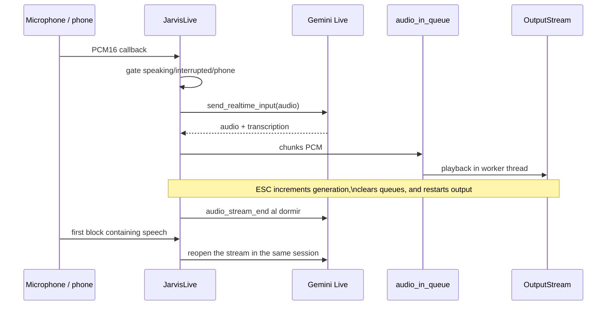
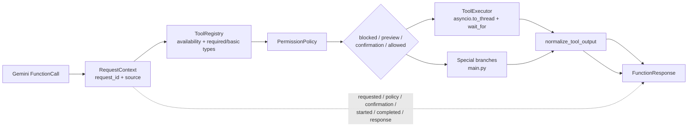
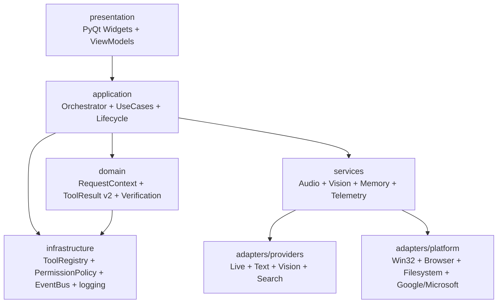

# Architecture by JARVIS Mark LI

## Document status

- Snapshot audited: 2026-07-28.
- Leading document: `JARVIS_Mark_LI_Arquitectura_y_Plan_de_Mejora_v1.1.pdf`.
- Code revision: commit base `0f60519`, `codex/audit-architecture-v1-1` working branch.
- Audited tree: 102 Python files versioned, 27,876 Python lines, 37 tools and 22 test files.
- Scope: Current architecture and incremental objective. It does not describe a rewrite.
- Local state: there were previous changes to the wake word and its supervisor; they were not modified by this audit.

## Executive summary

JARVIS is a local/cloud hybrid Windows application with two input processes: a wake word supervisor and the main PyQt6 application. `main.py` remains the composition root and also retains too many runtime responsibilities: Gemini Live session, audio, vision, dashboard, permissions, dispatch, reconnection, status and shutdown.

The repository already contains parts to be stored and completed:

- `core/tools`: `ToolDefinition`, `ToolRegistry`, `ToolExecutor` and `ToolResult`;
- `core/permissions`: policy, preferences, preview and confirmation levels;
- `core/live_session.py`: summary checkpoint and inactivity watchdog;
- memory versioned with temporary writing and replacement;
- connectors with tokens in `keyring`;
- `ui_mk2`: visual status, separate Core, Pet and workspaces;
- tests for permissions, tools, memory, Live session, security, UI and connectors.

The objective architecture should be extracted around these pieces, not duplicated. The first limits to close are origin and correlation of requests, real risk classification, atomic persistence, verifiable results, affinity of the Qt thread and status ownership.

## Map of the current system

## Components and responsibilities

| Component | Observed liability | Main units | State |
| --- | --- | --- | --- |
| `jarvis_launcher.py` | Selection `direct`/`wake`, approximate single instance, monitoring and restoration of the detector | `subprocess`, `psutil`, wake configuration | Implemented; previous local changes |
| `wake_word.py` | OpenWakeWord, failback Vosk, adaptive gate, stream PortAudio, heartbeat and app launch | `sounddevice`, `openwakeword`, `vosk`, `core.runtime_state` | Implemented; requires acoustic testing |
| `main.py` / `JarvisLive` | Composition root, Gemini Live, audio, vision, dashboard, permissions, tool dispatch, reconnection and shutdown | almost all subsystems | Functional, very coupled |
| `ui.py` | Window, widgets, camera, files, configuration, shortcuts, telemetry and callbacks | PyQt6, filesystem, subprocess, threads | Functional, monolithic |
| `ui_mk2/*` | Visual status, Core/Pet and workspaces Memory/Study/GEO | PyQt6 and WebEngine | Partial modulation |
| `core/tools/*` | Definitions, Registry, ToolResult v2, timeout and legacy adaptation | standard library | Integrated v2 contract; still inherited tools |
| `core/request_context.py` / `request_audit.py` | Correlation by Request and Sanitized JSONL Events | standard library | Integrated into normal and special routes |
| `core/events.py` | Typical border events, publication thread-safe and isolation of watchers | standard library | Embedded in owners, dashboard and logging |
| `core/permissions/*` | Minimum, preferences, simulation and contextual decision | `core.tools` | Implemented with integration gaps |
| `core/permissions/store.py` | Preferences v1/v2, atomic publishing, backup and recovery | filesystem, lock per path | Atomic within the process |
| `core/live_session.py` | Summary Checkpoint and Audio Watchdog | standard library | Isolated and tested |
| `services/*` | Session identity owners, interrupt/microphone, view/camera and shutdown | `core.live_session`, standard locks | Composed of `JarvisLive`; snapshots and typed metrics |
| `services/workers.py` | Lifecycle, health and restart limited by workers | typed callbacks, EventBus | Integrated browser/vision pilots |
| `services/agents.py` | Agents contracts, budget, canonical workspace and rollback | `pathlib`, typed contracts | Integrated into `dev_agent`; blocked generated execution |
| `core/runtime_state.py` | Observable status by process through durable and replaced JSON | filesystem | Validated temporal, `fsync` and replacement; deliberate silent errors |
| `actions/*` | OS, browser, files, vision, web, reminders, study and development | Heterogeneous; several matter Gemini | Broad, unequal contracts |
| `memory/*` | Memory v2, history, expiration, sensitivity, graph and scripts | JSON, filesystem | Implemented; cross-process blocking missing |
| `connectors/*` | Gmail, Calendar, Drive and Outlook | SDK Google/Microsoft, `keyring` | Implemented with uneven capabilities |
| `dashboard/server.py` | Authenticated LAN input of text, audio and files | FastAPI, Uvicorn, cryptography | Opt-in; text/audio retain remote origin to policy |
| `tests/*` | 218 tests, 1 missed and 28 subtests in snapshot | pytest/unittest, mocks | Solid base, no hardware or complete E2E |

## Life cycle

### Start

1. `jarvis_launcher.py` processes the mode.
2. In wake mode, it monitors `wake_word.py` and restarts with backoff if it fails.
3. `wake_word.py` checks single instance, load OpenWakeWord and starts at
listen; the Vosk backup is loaded into a thread daemon and attached to
Recognizer when ready.
4. After detecting the phrase, release the stream and launch `main.py` on its surface
The UI is born fullscreen; Pet Mode remains as an explicit transition from the
Same meeting.
5. `main.py` creates `QApplication`/`JarvisUI`, shows the first fullscreen frame
and just then starts the thread daemon `jarvis-core`.
6. `JarvisLive` loads the SDK in a deferred way, and `run()` creates the client
Gemini, opens a Live session and lifts shipping, reception,
playback, monitoring, proactivity and, if activated, dashboard.
The initial greeting is considered completed only after reproduction and remains
It is pending if the sitting is interrupted.

### Reconnection

- `LiveSessionState` retains the latest safe summable handle.
- The `JarvisLive.run()` loop reconnects with backoff.
- `AudioInactivityWatchdog` can only close the remote audio stream and reopen it when it detects voice.
- The local stream is recreated by PortAudio errors or stopped callbacks.

### Shutdown

- The `shutdown_jarvis` tool schedules shutdown after the farewell audio.
- There's a backup timeout.
- The UI and runner also try to restore the wake detector.
- The ownership of the closure continues to be distributed among UI, `JarvisLive`, launcher and wake supervisor.

## Complete flow of an interaction

1. The entrance arrives by microphone, UI or dashboard.
2. Gemini Live produces transcription, audio or `FunctionCall`.
3. `JarvisLive._execute_tool()` takes name and arguments.
4. Validate availability and basic types using `ToolRegistry`.
5. Evaluate `PermissionPolicy` and, where appropriate, prepares preview or voice confirmation.
6. Normal tools pass through `ToolExecutor`; the specials are followed by links inside `main.py`.
7. The inherited return is normalized to `ToolResult` basic.
8. `FunctionResponse` is created for Gemini.
9. UI and console receive status or text changes.

Since Phase 2 there is a local and independent `RequestContext` from Gemini.
`request_id` spreads to policy, confirmation, executor, `ToolResult`, audit
and `FunctionResponse`; the provider ID remains the secondary correlation.

## Audio flow

Colas and defences observed:

- `out_queue` has a maximum of 25 blocks and discards the oldest one when filled.
- `audio_in_queue` has no explicit maximum.
- `_playback_generation` invalidates old scriptures after an interruption.
- `_speaking_lock` protects part of the playback state.
- `RuntimeServices` is session restart/generation owner,
Interruption/microphone, cooldown/backpressure visual and shutdown.
- `_phone_active`, PCM queues and physical stream still remain low
`JarvisLive`; its boundaries and full closure remain pending.

## Runtime ownership

`JarvisLive` continues as composition root and retains the reference of
transport necessary to send/receive the Gemini protocol without modifying it.
The mutable state that used to be scattered flags is delegated:

| Owner | Exclusive status | Main transition | Metrics/snapshots |
| --- | --- | --- | --- |
| `SessionService` | observed transport, generation and summary checkpoint | bind/unbind with identity guard | connections, reconnections, updates |
| `AudioService` | microphone interrupt, generation, watchdog and heartbeat | switch/release/reset | interruptions and recoveries |
| `VisionService` | In-flight analysis, cooldown and frame pending | try/finally/reset | analysis, accepted/discarded frames |
| `LifecycleService` | request, farewell, drainage, deadline and closure | request/observe/begin 11 | applications and closure status |

`RuntimeServices.on_transport_connected()` restarts only transient state of
audio/vision and retains the checkpoint. A late disconnect cannot clean up
a new transport. Snapshots are immutable and do not contain audio,
images, prompts or secrets.

The four owners publish immutable facts using the composite `EventBus`
in `main.py`. Publication occurs outside your locks and a failed observer does not
alters the transition. Session, interruption, visual analysis and shutdown include
counters allowed; view and shutdown retain `request_id` when the
The bus does not carry commands or payloads.

`WorkerSupervisor` extends that ownership to background resources. Browser and
view record `start/stop/health`, respond to an event loop ping and only
restart after proving previous closure. Cleanup failed
`failed` and blocks duplicates. Its snapshots/events contain status and
counters, never URLs, images, audio, prompts or session data.

## Toolflow

Current flow problems:

- Phase 1 incorporated `InputSource` and preserved `local`, `ui`, `wake`,
`dashboard_text` or `dashboard_audio` up to `PermissionPolicy`.
- `save_memory` validates registration and policy before writing.
- `file_processor` and `code_helper` have minimums per operation and no longer leave
free writing or execution by default.
- Phase 2 correlates normal and special routes with a `request_id` and records
only metadata listed in a sink that fails without interrupting execution.
- `ToolExecutor` delivers `CancellationToken` only to handlers who accept it,
allows you to mark them by `request_id` and wait cleanup during a grace
A non-cooperative legacy handler can still continue after
timeout and remains explicitly `effect=unknown`.
- `dev_agent` checks between planning and writing, but from
Phase 13 only creates content previews. It does not install dependencies, does not accept
model commands and does not execute processes; a blocking call to the provider
still depends on the SDK returning after receiving the external cancellation.
- `ToolResult` v2 separates execution, effect, verification, rollback, duration and
evidence; inherited tools remain `effect=unknown` until migrated.
- `file_controller` pilot captures determined route, size and SHA-256 after
`create_file`, `copy` and `move` for regular files. Just communicate
`applied/verified` when the evidence matches; directories retain the
legacy adapter while defining its recursive verification.
- Standardisation still infers flaws from text prefixes.
- Several branches inherited under `elif name == ...` are unattainable because those tools have already passed through the normal branch.

## UI flow

- `ui.py` creates the main window, camera, panels, configuration, shortcuts and telemetry.
- `ui_mk2.state.VisualStateController` normalizes six visual states.
- `ui_mk2` separates Core, Pet, Memory, Study and web workspaces.
- `main.py` preserves `JarvisUI` for lifecycle runtime, but delivers
`UiCommandFacade` to all handlers executed by `ToolExecutor`.
- The façade only offers presentation commands and snapshots; it does not expose
windows, widgets, QAplication or filesystem/network/subprocess methods.
- `JarvisUI` glues mutations using Qt signals. Commands you need
result (`interface_control` and Study) expect confirmation produced by
the slot on the chart thread.
- Selected file, listening mode and microphone status are read from
`MainWindow.tool_snapshot()` under `RLock`, never from a widget.
- The dashboard publishes `DashboardConnected`; `JarvisLive` consumes it and the
visual notification uses `_phone_connected_sig`. Camera callback is
swaps under `_cam_lock` and is invoked outside the lock.

The contract and its invariants are detailed in
`docs/ui_thread_boundary.md`.

Phase 14 evaluated QML without connecting it to runtime. In five processes per variant,
the prototype QML improved 16.3% the p95 packaging, but consumed 58.8% more RSS and its
cold startup was 239.6% slower. Guardrails demanded an advantage from the
less 15% without regressions greater than 10%, so the architecture of
presentation continues in PyQt Widgets. The result offscreen/software does not
replaces a GPU, visual or packaging test; those three evidences would be
mandatory before the decision is reopened.

## Memory flow

1. `memory_manager.py` loads `memory/long_term.json`.
2. Migrate pre-forms to v2 schema and retain backup.
3. CRUD uses IDs, history, categories, sensitivity, expiration and logical deletion.
4. `_atomic_write()` validates bytes, writes a temporary in the same directory,
runs `flush`/`fsync` and publishes with `os.replace`.
5. The prompt receives a limited view and sensitive memories are written in listings.
6. The graph is built only with real records and explicit relationships.

Limits:

- the lock is only intra-process;
- the lock remains intra-process and does not avoid lost updates between
processes;
- there is no optional sensitive content encryption;
- `save_memory` already crosses policy, but continues as a special route;
- `script_memory.py` retains code previews, but its raw execution is
blocked until migrating each routine to declarative actions allowed.

## Threads, tasks and queues

| Appeal | Approximate Creator | Use | Outstanding risk |
| --- | --- | --- | --- |
| Core Thread | `main.main()` | `asyncio.run(JarvisLive.run())` | daemon; shutdown distributed |
| Thread of metrics | `ui.py` | CPU/GPU/temperature | lifecycle own non-formalized |
| Camera Thread | `ui.py` | continuous capture | callbacks and saved generation |
| Threads browser/vision | `WorkerSupervisor` + legacy adapters | loops Playwright/vision | supervised; other action workers still inherited |
| `TaskGroup` Live | `JarvisLive.run()` | send, listen, receive, play, monitor and proactivity | mix lifecycle services |
| `audio_in_queue` | Live session | output audio | no explicit limit |
| `out_queue(maxsize=25)` | Live session | Microphone/phone PCM | local discard policy |
| Dashboard tails | `DashboardServer` | commands, audio and broadcast | propagated origin; lifecycle still distributed |
| memory locks/scripts | memory modules | Local serialization | do not block other processes |

## Configuration, secrets and dependencies

The actual API, OAuth, permissions, certificates, memory and log files are ignored by Git. The audit only checked their presence, did not read their content.

The configuration has a unique owner in `config.settings`. The module loads and
validates an immutable `AppSettings` per path, searches it so that each process reads
the document only once and publishes changes using `update_settings()`: merge
compatible, prior validation, temporary in the same directory, `fsync` and
`os.replace`. `main.py`, UI, actions, dashboard, memory and local customers
consume that snapshot or its compatible view; none opens the private file
Phase 9 also closed the ownership of models/deadline/SDK for
`web_search`.

Baseline validation executes `scripts/check_secrets.py` on each file
versioned and on the exact version of all blob staged. Control rejects
known private routes and formats of high-confidence credentials; only
report path, line and rule, never the value found.
versioned are left out of this gate and continue to be protected by `.gitignore` and
local review.

`core.structured_logging.StructuredRuntimeLog` is the observability owner
general in the composition root. Emits the same sanitized JSON to console and to
`logs/runtime.jsonl`, with rotation and limited backups.
`RequestContext` for correlation and only retains metadata allowed; a failure
opening the file makes the console available and never prevents booting.
`RequestAuditSink` remains the specialized tool phase protocol.
Wake `print()` and legacy diagnostics remain compatible and
They will migrate one boundary at a time.

The continuous quality is also incremental. `scripts/validate_quality.ps1`
Run Ruff on a module/tests migrados and mypy list of six
The baseline calls that gate before the scanning of
secrets and the suite. `.github/workflows/quality.yml` plays the same
Windows contract with Python 3.12, limited timeout and repository permissions
read-only; not yet generalized to unverified platforms.

`requirements.txt` allows you to start the current base in the existing environment, but does not declare several units imported by announced capabilities: `python-docx`, `pandas`, `openpyxl`, `PyPDF2`/`pdfplumber`, `pydub`, `faster-whisper`, `kokoro`, `miniaudio` and `torch`. Some are optional or legacy not connected; that distinction is not yet documented or separated into extras.

## Main architectural problems

1. Remote origin lost before policy.
2. Incomplete risk classification for tools with writing or execution.
3. `main.py` still combines transport, policy and use cases; the state of
session/audio/vision/lifecycle is already extracted in owners.
4. Large UI and potential mutations outside the Qt thread.
5. Cooperative cancellation available only on the `dev_agent` pilot; handlers
inherited and blocking transports are still pending.
6. Persistence of non-atomic permits.
7. No extreme-to-end correlation or common audit of tool call.
8. `ToolResult` insufficient to affirm external effects.
9. Gemini suppliers still directly imported by numerous shares;
`web_search` already consumes an injected port.
10. Configuration, models and handling of distributed errors.
11. 360 wide exception handlers, 67 with `pass`, and 303 called `print()` in the versioned tree.
12. Optional units/legacy mixed with main capabilities.

The agent authority is separated from the text generation.
`AgentSupervisor` validates unreliable plans, possesses every writing and produces
typed evidence. Workspace avoids escapes and overwrites, but does not
considers an execution sandbox. That is why `dev_agent` only materializes one
preview: does not accept commands or dependencies of the model, does not execute code
and does not open external processes. Memorized raw routines also remain
blocked; its catalogue is preserved for post-action migration
declaratives allowed.

## Incremental Target Architecture

### Migration rules

- Store `core/tools`, `core/permissions` and `core/live_session`.
- Keep `main.py` as temporary root composition.
- Do not move functions without defining ownership, inputs, outputs, errors and lifecycle.
- One change per boundary: traceability/persistence before audio/UI.
- Keep legacy adapters up to proven equivalence.
- Every tool path must retain policy, correlation, timing, audit and verification.
- The UI issues commands and consumes snapshots/events in the Qt thread.
- Separate `LiveConversationProvider`, `TextGenerationProvider`, `VisionAnalysisProvider` and `GroundedSearchProvider`.
- Do not create an event bus for local logic; use it only between limits.

## Discrepancies between PDF and code

| Affirmation of PDF | Current evidence | Evaluation |
| --- | --- | --- |
| Remote Source Raises Minimum | `InputSource` spreads from dashboard text/audio and the policy fails closed for unknown sources | Phase 1 completed |
| All tool calls go through central policy | `save_memory` was moved behind registration, policy and confirmation | Complied for 37 tools; persistence of post-policy special clamps |
| ToolRegistry and ToolExecutor Centralize Flow | There are, but seven tools are special and there is an unattainable legacy dispatch | Partial |
| PermissionStore must be atomic | Temporary in the same directory, `fsync`, validation, backup and `os.replace` | Phase 3 completed; interprocess lock pending |
| Memory uses atomic writing | Validated time frame, `fsync`, recoverable backup and `os.replace` | Hardened in Phase 15; interprocess lock missing |
| 37 tools, 102 Python, 22 tests | Direct count matches | Confirmed |
| Suite 218/1/28 | Local execution coincides | Confirmed |
| UI has 4,535 lines and main 2.331 | Direct count matches | Confirmed |
| Access to Gemini distributed | `main.py` and at least ten actions import the SDK directly | Confirmed |
| Protected settings/secrets | `.gitignore`, secret gate, sanitization and cached/atomic owner | Phase 10 completed; unversed history and files left out of the gate |

## Validation limits for this audit

Syntax, imports, launcher `--help`, import offscreen of `main.py`, installed dependencies and automatic suite were verified. No actual Gemini session was opened, no microphone/camera was taken, no LAN dashboard was activated, no external accounts were touched and no tools were executed with real effects.

## Post-snapshot evolution

### 2026-07-28 - Phase 0

- `docs/tool_migration_matrix.md` catalogues the 37 tools and seven
special routes with risk, policy, preview, return, verification, rollback,
timeout, route, coverage and pending migration.
- `tests/test_tool_inventory.py` prevents names, risk, timeout or path from being
Disinchronise from the actual record.
- `requirements-dev.txt` separates pytest from the main runtime.
- `scripts/validate_baseline.ps1` reproduces dependencies, launcher, imports,
UI offscreen, syntax, inventory, suite and diff.
- Clean installation on Python 3.14.6 and validations completed
without accessing hardware, accounts, secrets or external effects.

### 2026-07-29 - Phase 13

- `AgentTask`, `AgentBudget` and `AgentResult` make explicit correlation,
boundaries, workspace, evidence and rollback.
- `AgentSupervisor` uses determined paths and real descent; it rejects traversal,
absolute, misleading prefixes, external symlinks and existing projects.
- `dev_agent` was reduced to contained generation of previews. It does not install,
executes or takes commands from the model output.
- `script_memory` preserves routines as previews, but does not execute code
raw and no longer obtains a `FREE` bypass because it is registered.
- Tests cover prompt injection, dependencies, time, excessive output,
escapes, symlinks when available and partial rollback unused
Gemini, network, accounts, hardware or real processes.

### 2026-07-29 - Phase 14

- A benchmark in isolated processes compared equivalent prototypes of Widgets
and QML regardless of `ui.py`, `main.py` or runtime services.
- QML showed better pacing p95, but wide regressions of startup and memory;
the automatic and architectural decision is to defer its adoption.
- PyQt Widgets remains the productive presentation. Benchmark, its
thresholds, limits and reopening conditions are documented in
`docs/ui_qml_benchmark.md`.

### 2026-07-29 - Phase 15

- `docs/global_acceptance.json` represents exactly the 19 criteria
and separates verified, partial and manual evidence.
- `scripts/check_global_acceptance.py` rejects incomplete inventory, states
Incoherent, absent evidence or external routes. Strict mode does not allow
close as long as there is a gap.
- Memory validates and makes temporary durable, backup and publication.
corrupt does not replace the last valid backup and can recover from it.
- `runtime_state` preserves the latest complete JSON for failure, does not allow
details replace reserved fields and maintain your telemetry contract
best-effort that never prevents booting.

### 2026-07-29 - Phase 16

- `docs/operational_change_control.json` is the structured registry of the 19
controls of Section 16 and of each phase completed since 15.
- The gate requires ownership, policy, verification, rollback,
cancellation/timeout/reconnection, compatibility, metrics and specific benefit
of abstractions before accepting the documentary closure.
- References are resolved within the repository and sensitive paths are
The external acts—reading of `AGENTS.md`, initial status and note
They obsidise—they explicitly remain manual.
- The contract does not enter the runtime or create a second architectural authority:
`ROADMAP.md` retains phase status and script only checks
coherence/evidence.

### 2026-07-29 - Phase 17

- `docs/audit_closure.json` retains all eight source groups and five boundaries
methodological aspects of the last section of the PDF.
- The gate checks contained/existing paths and synchronizes the conclusion with
`docs/global_acceptance.json`.
- The execution of the PDF roadmap is closed, but the architecture is not
declares fully accepted: 13 global criteria remain partial or
Manuals.
- No changes were made to runtime, Gemini, audio, UI, tools or adapters.
It only makes the scope verifiable and prevents its limits from disappearing.
