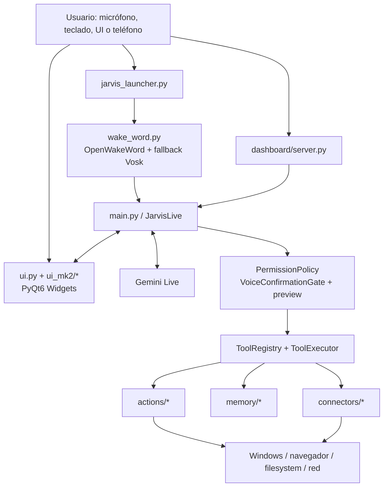
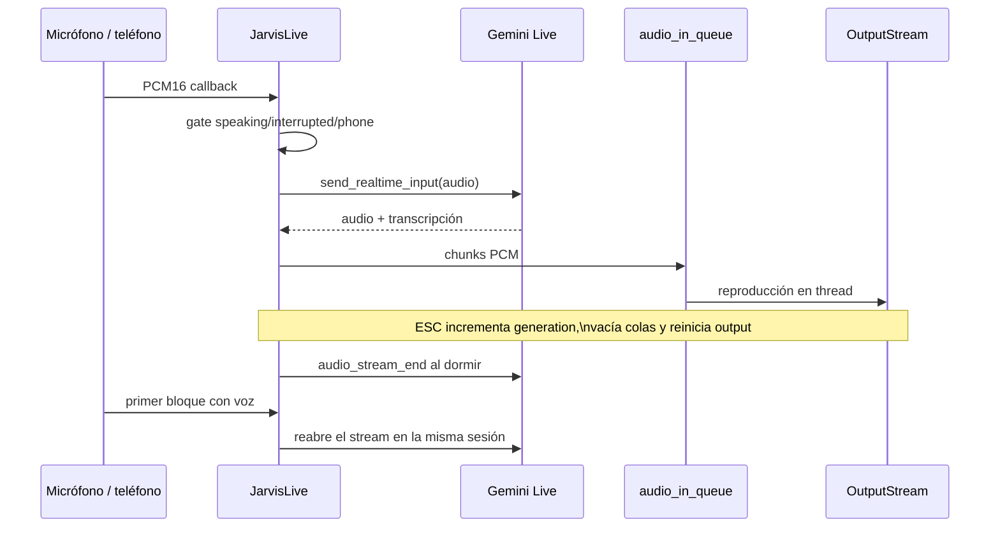
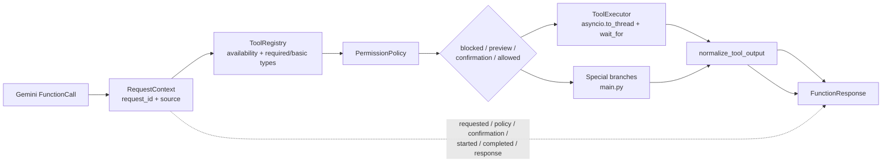
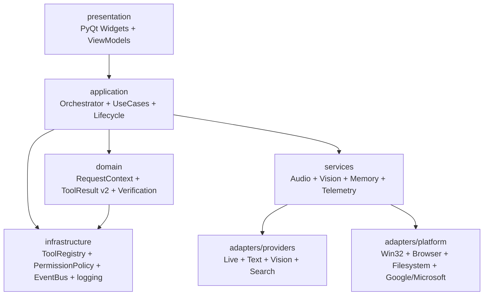

# Arquitectura de JARVIS Mark LI

## Estado del documento

- Snapshot auditado: 2026-07-28.
- Documento rector: `JARVIS_Mark_LI_Arquitectura_y_Plan_de_Mejora_v1.1.pdf`.
- Revisión de código: commit base `0f60519`, rama de trabajo `codex/audit-architecture-v1-1`.
- Árbol auditado: 102 archivos Python versionados, 27.876 líneas Python, 37 herramientas y 22 archivos de prueba.
- Alcance: arquitectura actual y objetivo incremental. No describe una reescritura.
- Estado local: había cambios previos en el wake word y su supervisor; no fueron modificados por esta auditoría.

## Resumen ejecutivo

JARVIS es una aplicación Windows híbrida local/nube con dos procesos de entrada: un supervisor de wake word y la aplicación PyQt6 principal. `main.py` sigue siendo el centro de composición y también conserva demasiadas responsabilidades de runtime: sesión Gemini Live, audio, visión, dashboard, permisos, dispatch, reconexión, estado y shutdown.

El repositorio ya contiene piezas que deben conservarse y completar:

- `core/tools`: `ToolDefinition`, `ToolRegistry`, `ToolExecutor` y `ToolResult`;
- `core/permissions`: política, preferencias, preview y niveles de confirmación;
- `core/live_session.py`: checkpoint resumible y watchdog de inactividad;
- memoria versionada con escritura temporal y reemplazo;
- conectores con tokens en `keyring`;
- `ui_mk2`: estado visual, Core, Pet y workspaces separados;
- tests para permisos, herramientas, memoria, sesión Live, seguridad, UI y conectores.

La arquitectura objetivo debe extraerse alrededor de esas piezas, no duplicarlas. Los primeros límites a cerrar son origen y correlación de solicitudes, clasificación real de riesgo, persistencia atómica, resultados verificables, afinidad del hilo Qt y ownership de estado.

## Mapa del sistema actual

## Componentes y responsabilidades

| Componente | Responsabilidad observada | Dependencias principales | Estado |
| --- | --- | --- | --- |
| `jarvis_launcher.py` | Selección `direct`/`wake`, instancia única aproximada, supervisión y restauración del detector | `subprocess`, `psutil`, configuración wake | Implementado; cambios locales previos |
| `wake_word.py` | OpenWakeWord, fallback Vosk, gate adaptativo, stream PortAudio, heartbeat y lanzamiento de la app | `sounddevice`, `openwakeword`, `vosk`, `core.runtime_state` | Implementado; requiere prueba acústica |
| `main.py` / `JarvisLive` | Composition root, Gemini Live, audio, visión, dashboard, permisos, tool dispatch, reconexión y shutdown | casi todos los subsistemas | Funcional, muy acoplado |
| `ui.py` | Ventana, widgets, cámara, archivos, configuración, accesos directos, telemetría y callbacks | PyQt6, filesystem, subprocess, threads | Funcional, monolítico |
| `ui_mk2/*` | Estado visual, Core/Pet y workspaces Memory/Study/GEO | PyQt6 y WebEngine | Modularización parcial |
| `core/tools/*` | Definiciones, registro, ToolResult v2, timeout y adaptación legacy | biblioteca estándar | Contrato v2 integrado; tools aún heredadas |
| `core/request_context.py` / `request_audit.py` | Correlación por solicitud y eventos JSONL sanitizados | biblioteca estándar | Integrado en rutas normal y especial |
| `core/events.py` | Eventos tipados de fronteras, publicación thread-safe y aislamiento de observers | biblioteca estándar | Integrado en owners, dashboard y logging |
| `core/permissions/*` | Mínimos, preferencias, simulación y decisión contextual | `core.tools` | Implementado con huecos de integración |
| `core/permissions/store.py` | Preferencias v1/v2, publicación atómica, backup y recuperación | filesystem, lock por ruta | Atómico dentro del proceso |
| `core/live_session.py` | Checkpoint resumible y watchdog de audio | biblioteca estándar | Aislado y probado |
| `services/*` | Owners de identidad de sesión, interrupción/micrófono, visión/cámara y shutdown | `core.live_session`, locks estándar | Compuestos por `JarvisLive`; snapshots y métricas tipadas |
| `services/workers.py` | Lifecycle, health y restart acotado de workers | callbacks tipados, EventBus | Pilotos browser/visión integrados |
| `services/agents.py` | Contratos, budget, workspace canónico y rollback de agentes | `pathlib`, contratos tipados | Integrado en `dev_agent`; ejecución generada bloqueada |
| `core/runtime_state.py` | Estado observable por proceso mediante JSON durable y reemplazado | filesystem | Temporal validado, `fsync` y reemplazo; errores silenciosos deliberados |
| `actions/*` | SO, navegador, archivos, visión, web, recordatorios, estudio y desarrollo | heterogéneas; varias importan Gemini | Amplio, contratos desiguales |
| `memory/*` | Memoria v2, historial, expiración, sensibilidad, grafo y scripts | JSON, filesystem | Implementado; falta locking entre procesos |
| `connectors/*` | Gmail, Calendar, Drive y Outlook | SDK Google/Microsoft, `keyring` | Implementado con capacidades desiguales |
| `dashboard/server.py` | Entrada LAN autenticada de texto, audio y archivos | FastAPI, Uvicorn, criptografía | Opt-in; texto/audio conservan origen remoto hasta policy |
| `tests/*` | 218 tests, 1 omitido y 28 subtests en el snapshot | pytest/unittest, mocks | Base sólida, sin hardware ni E2E completo |

## Ciclo de vida

### Arranque

1. `jarvis_launcher.py` procesa el modo.
2. En modo wake, supervisa `wake_word.py` y reinicia con backoff si falla.
3. `wake_word.py` verifica instancia única, carga OpenWakeWord y comienza a
   escuchar; el respaldo Vosk se carga en un thread daemon y se adjunta al
   recognizer cuando queda listo.
4. Tras detectar la frase, libera el stream y lanza `main.py` en su superficie
   base. La UI nace fullscreen; Pet Mode queda como transición explícita de la
   misma sesión.
5. `main.py` crea `QApplication`/`JarvisUI`, muestra el primer frame fullscreen
   y recién entonces inicia el thread daemon `jarvis-core`.
6. `JarvisLive` carga de forma diferida el SDK, y `run()` crea el cliente
   Gemini, abre una sesión Live y levanta tareas de envío, recepción,
   reproducción, monitorización, proactividad y, si fue activado, dashboard.
   El saludo inicial sólo se considera completado tras reproducirse y queda
   pendiente si la sesión se interrumpe.

### Reconexión

- `LiveSessionState` conserva el último handle resumible seguro.
- El loop de `JarvisLive.run()` vuelve a conectar con backoff.
- `AudioInactivityWatchdog` puede cerrar sólo el stream remoto de audio y reabrirlo al detectar voz.
- El stream local se recrea ante errores de PortAudio o callbacks detenidos.

### Shutdown

- La herramienta `shutdown_jarvis` programa el cierre después del audio de despedida.
- Existe un timeout de respaldo.
- La UI y el runner también intentan restaurar el detector wake.
- El ownership del cierre continúa distribuido entre UI, `JarvisLive`, launcher y wake supervisor.

## Flujo completo de una interacción

1. La entrada llega por micrófono, UI o dashboard.
2. Gemini Live produce transcripción, audio o `FunctionCall`.
3. `JarvisLive._execute_tool()` toma nombre y argumentos.
4. Valida disponibilidad y tipos básicos mediante `ToolRegistry`.
5. Evalúa `PermissionPolicy` y, cuando corresponde, prepara preview o confirmación por voz.
6. Las herramientas normales pasan por `ToolExecutor`; las especiales siguen branches dentro de `main.py`.
7. El retorno heredado se normaliza a `ToolResult` básico.
8. Se crea `FunctionResponse` para Gemini.
9. UI y consola reciben cambios de estado o texto.

Desde Fase 2 existe un `RequestContext` local e independiente de Gemini. Su
`request_id` se propaga a policy, confirmación, executor, `ToolResult`, auditoría
y `FunctionResponse`; el ID del proveedor queda como correlación secundaria.

## Flujo de audio

Colas y defensas observadas:

- `out_queue` tiene máximo de 25 bloques y descarta el más antiguo al llenarse.
- `audio_in_queue` no tiene máximo explícito.
- `_playback_generation` invalida escrituras antiguas después de una interrupción.
- `_speaking_lock` protege parte del estado de reproducción.
- `RuntimeServices` es owner de reanudación/generación de sesión,
  interrupción/micrófono, cooldown/backpressure visual y shutdown.
- `_phone_active`, las colas PCM y el stream físico todavía permanecen bajo
  `JarvisLive`; sus límites y cierre completo siguen pendientes.

## Ownership de runtime

`JarvisLive` continúa como composition root y conserva la referencia de
transporte necesaria para enviar/recibir el protocolo Gemini sin modificarlo.
El estado mutable que antes eran flags dispersos se delega:

| Owner | Estado exclusivo | Transición principal | Métricas/snapshot |
| --- | --- | --- | --- |
| `SessionService` | transporte observado, generación y checkpoint resumible | bind/unbind con guard de identidad | conexiones, reconexiones, updates |
| `AudioService` | interrupción, generación, watchdog y heartbeat de micrófono | interrupt/release/reset | interrupciones y recuperaciones |
| `VisionService` | análisis en vuelo, cooldown y frame pendiente | try/finally/reset | análisis, frames aceptados/descartados |
| `LifecycleService` | solicitud, despedida, drenaje, deadline y cierre | request/observe/begin once | solicitudes y estado de cierre |

`RuntimeServices.on_transport_connected()` reinicia sólo estado transitorio de
audio/visión y conserva el checkpoint. Un disconnect atrasado no puede limpiar
un transporte nuevo. Los snapshots son inmutables y no contienen audio,
imágenes, prompts ni secretos.

Los cuatro owners publican hechos inmutables mediante el `EventBus` compuesto
en `main.py`. La publicación ocurre fuera de sus locks y un observer fallido no
altera la transición. Sesión, interrupción, análisis visual y shutdown incluyen
contadores allowlisted; visión y shutdown conservan `request_id` cuando la
transición nace de una tool. El bus no transporta comandos ni payloads.

`WorkerSupervisor` extiende ese ownership a recursos de background. Browser y
visión registran `start/stop/health`, responden a un ping de event loop y sólo
reinician después de demostrar el cierre anterior. Cleanup fallido queda
`failed` y bloquea duplicados. Sus snapshots/eventos contienen estado y
contadores, nunca URLs, imágenes, audio, prompts ni datos de sesión.

## Flujo de herramientas

Problemas actuales del flujo:

- Fase 1 incorporó `InputSource` y conserva `local`, `ui`, `wake`,
  `dashboard_text` o `dashboard_audio` hasta `PermissionPolicy`.
- `save_memory` valida registro y policy antes de escribir.
- `file_processor` y `code_helper` tienen mínimos por operación y ya no dejan
  escritura o ejecución libres por omisión.
- Fase 2 correlaciona rutas normales y especiales con un `request_id` y registra
  sólo metadata enumerada en un sink que falla sin interrumpir ejecución.
- `ToolExecutor` entrega `CancellationToken` sólo a handlers que lo aceptan,
  permite señalarlos por `request_id` y espera cleanup durante una gracia
  acotada. Un handler legacy no cooperativo todavía puede continuar tras
  timeout y queda explícitamente `effect=unknown`.
- `dev_agent` comprueba checkpoints entre planificación y escritura, pero desde
  Fase 13 sólo crea previews contenidos. No instala dependencias, no acepta
  comandos del modelo y no ejecuta procesos; una llamada bloqueante al provider
  aún depende de que el SDK retorne después de recibir la cancelación externa.
- `ToolResult` v2 separa ejecución, efecto, verificación, rollback, duración y
  evidencia; las tools heredadas permanecen `effect=unknown` hasta migrarse.
- El piloto de `file_controller` captura ruta resuelta, tamaño y SHA-256 después
  de `create_file`, `copy` y `move` para archivos regulares. Sólo comunica
  `applied/verified` cuando la evidencia coincide; los directorios conservan el
  adaptador legacy mientras se define su verificación recursiva.
- La normalización todavía infiere fallos a partir de prefijos de texto.
- Varios branches heredados bajo `elif name == ...` son inalcanzables porque esas herramientas ya pasaron por el branch normal.

## Flujo de UI

- `ui.py` crea la ventana principal, cámara, paneles, configuración, accesos directos y telemetría.
- `ui_mk2.state.VisualStateController` normaliza seis estados visuales.
- `ui_mk2` separa Core, Pet, Memory, Study y workspaces web.
- `main.py` conserva `JarvisUI` para el lifecycle del runtime, pero entrega
  `UiCommandFacade` a todos los handlers ejecutados por `ToolExecutor`.
- La fachada sólo ofrece comandos de presentación y snapshots; no expone
  ventanas, widgets, QApplication ni métodos de filesystem/red/subprocess.
- `JarvisUI` encola mutaciones mediante señales Qt. Los comandos que necesitan
  resultado (`interface_control` y Study) esperan una confirmación producida por
  el slot en el hilo gráfico.
- Archivo seleccionado, modo de escucha y estado del micrófono se leen desde
  `MainWindow.tool_snapshot()` bajo `RLock`, nunca desde un widget.
- El dashboard publica `DashboardConnected`; `JarvisLive` lo consume y la
  notificación visual usa `_phone_connected_sig`. El callback de cámara se
  intercambia bajo `_cam_lock` y se invoca fuera del lock.

El contrato y sus invariantes están detallados en
`docs/ui_thread_boundary.md`.

Fase 14 evaluó QML sin conectarlo al runtime. En cinco procesos por variante,
el prototipo QML mejoró 16,3% el pacing p95, pero consumió 58,8% más RSS y su
startup frío fue 239,6% más lento. Los guardrails exigían una ventaja de al
menos 15% sin regresiones mayores al 10%, por lo que la arquitectura de
presentación continúa en PyQt Widgets. El resultado offscreen/software no
sustituye una prueba GPU, visual o de packaging; esas tres evidencias serían
obligatorias antes de reabrir la decisión.

## Flujo de memoria

1. `memory_manager.py` carga `memory/long_term.json`.
2. Migra formatos anteriores a esquema v2 y conserva backup.
3. CRUD usa IDs, historial, categorías, sensibilidad, expiración y borrado lógico.
4. `_atomic_write()` valida bytes, escribe un temporal en el mismo directorio,
   ejecuta `flush`/`fsync` y publica con `os.replace`.
5. El prompt recibe una vista limitada y las memorias sensibles se redactan en listados.
6. El grafo se construye sólo con registros reales y relaciones explícitas.

Límites:

- el lock es sólo intra-proceso;
- el lock sigue siendo intra-proceso y no evita actualizaciones perdidas entre
  procesos;
- no hay cifrado opcional de contenido sensible;
- `save_memory` ya atraviesa policy, pero continúa como ruta especial;
- `script_memory.py` conserva previews de código, pero su ejecución cruda está
  bloqueada hasta migrar cada rutina a acciones declarativas allowlisted.

## Threads, tareas y colas

| Recurso | Creador aproximado | Uso | Riesgo pendiente |
| --- | --- | --- | --- |
| Thread del core | `main.main()` | `asyncio.run(JarvisLive.run())` | daemon; shutdown distribuido |
| Thread de métricas | `ui.py` | CPU/GPU/temperatura | lifecycle propio no formalizado |
| Thread de cámara | `ui.py` | captura continua | callbacks y generación guardada |
| Threads browser/visión | `WorkerSupervisor` + adaptadores heredados | loops Playwright/visión | supervisados; otros workers de actions siguen heredados |
| `TaskGroup` Live | `JarvisLive.run()` | enviar, escuchar, recibir, reproducir, monitor y proactividad | mezcla lifecycle de servicios |
| `audio_in_queue` | sesión Live | audio de salida | sin límite explícito |
| `out_queue(maxsize=25)` | sesión Live | PCM de micrófono/teléfono | política de descarte local |
| colas dashboard | `DashboardServer` | comandos, audio y broadcasts | origen propagado; lifecycle todavía distribuido |
| locks memoria/scripts | módulos de memoria | serialización local | no bloquean otros procesos |

## Configuración, secretos y dependencias

Los archivos reales de API, OAuth, permisos, certificados, memoria y logs están ignorados por Git. La auditoría sólo comprobó su presencia, no leyó su contenido.

La configuración tiene un único owner en `config.settings`. El módulo carga y
valida un `AppSettings` inmutable por ruta, lo cachea para que cada proceso lea
el documento una sola vez y publica cambios mediante `update_settings()`: merge
compatible, validación previa, temporal en el mismo directorio, `fsync` y
`os.replace`. `main.py`, UI, actions, dashboard, memoria y clientes locales
consumen ese snapshot o su vista compatible; ninguno abre el archivo privado
directamente. Fase 9 cerró además el ownership de modelos/deadline/SDK para
`web_search`.

La validación baseline ejecuta `scripts/check_secrets.py` sobre cada archivo
versionado y sobre la versión exacta de todo blob staged. El control rechaza
rutas privadas conocidas y formatos de credenciales de alta confianza; sólo
informa ruta, línea y regla, nunca el valor encontrado. Los archivos no
versionados quedan fuera de este gate y continúan protegidos por `.gitignore` y
la revisión local.

`core.structured_logging.StructuredRuntimeLog` es el owner de observabilidad
general en el composition root. Emite el mismo JSON sanitizado a consola y a
`logs/runtime.jsonl`, con rotación y backups acotados. Acepta
`RequestContext` para correlación y sólo conserva metadata allowlisted; un fallo
al abrir el archivo deja disponible la consola y nunca impide el arranque.
`RequestAuditSink` sigue siendo el protocolo especializado para fases de tool.
Los `print()` de wake y diagnósticos heredados permanecen por compatibilidad y
se migrarán por frontera.

La calidad continua también es incremental. `scripts/validate_quality.ps1`
ejecuta Ruff sobre una allowlist de módulos/tests migrados y mypy sobre seis
módulos productivos tipados. El baseline llama ese gate antes del escaneo de
secretos y la suite. `.github/workflows/quality.yml` reproduce el mismo
contrato en Windows con Python 3.12, timeout acotado y permisos de repositorio
de sólo lectura; no se generaliza todavía a plataformas no verificadas.

`requirements.txt` permite iniciar la base actual en el entorno existente, pero no declara varias dependencias importadas por capacidades anunciadas: `python-docx`, `pandas`, `openpyxl`, `PyPDF2`/`pdfplumber`, `pydub`, `faster-whisper`, `kokoro`, `miniaudio` y `torch`. Algunas son opcionales o legado no conectado; esa distinción todavía no está documentada ni separada en extras.

## Problemas arquitectónicos principales

1. Origen remoto perdido antes de policy.
2. Clasificación de riesgo incompleta para herramientas con escritura o ejecución.
3. `main.py` aún combina transporte, policy y casos de uso; el estado de
   sesión/audio/visión/lifecycle ya está extraído en owners.
4. UI grande y mutaciones potenciales fuera del hilo Qt.
5. Cancelación cooperativa disponible sólo en el piloto `dev_agent`; handlers
   heredados y transportes bloqueantes siguen pendientes.
6. Persistencia de permisos no atómica.
7. Sin correlación extremo a extremo ni auditoría común de tool calls.
8. `ToolResult` insuficiente para afirmar efectos externos.
9. Proveedores Gemini aún importados directamente por numerosas acciones;
   `web_search` ya consume un puerto inyectado.
10. Configuración, modelos y manejo de errores distribuidos.
11. 360 handlers de excepción amplios, 67 con `pass`, y 303 llamadas `print()` en el árbol versionado.
12. Dependencias opcionales/legacy mezcladas con capacidades principales.

La autoridad de agentes queda separada de la generación de texto.
`AgentSupervisor` valida planes no confiables, posee cada escritura y produce
evidencia tipada. El workspace evita escapes y sobrescrituras, pero no se
considera un sandbox de ejecución. Por eso `dev_agent` sólo materializa una
vista previa: no acepta comandos ni dependencias del modelo, no ejecuta código
y no abre procesos externos. Las rutinas crudas memorizadas también permanecen
bloqueadas; su catálogo se conserva para una migración posterior a acciones
declarativas allowlisted.

## Arquitectura objetivo incremental

### Reglas de migración

- Conservar `core/tools`, `core/permissions` y `core/live_session`.
- Mantener `main.py` como composition root temporal.
- No mover funciones sin definir ownership, entradas, salidas, errores y lifecycle.
- Un cambio por frontera: trazabilidad/persistencia antes que audio/UI.
- Mantener adaptadores heredados hasta equivalencia probada.
- Toda ruta de herramientas debe conservar policy, correlación, timeout, auditoría y verificación.
- La UI emite comandos y consume snapshots/eventos en el hilo Qt.
- Separar `LiveConversationProvider`, `TextGenerationProvider`, `VisionAnalysisProvider` y `GroundedSearchProvider`.
- No crear un bus de eventos para lógica local; usarlo sólo entre límites.

## Discrepancias entre PDF y código

| Afirmación del PDF | Evidencia actual | Evaluación |
| --- | --- | --- |
| Fuente remota eleva el mínimo | `InputSource` se propaga desde dashboard texto/audio y la policy falla cerrada para fuentes desconocidas | Cumplido en Fase 1 |
| Todas las tool calls pasan por policy central | `save_memory` fue movida detrás de registro, policy y confirmación | Cumplido para las 37 tools; persisten branches especiales posteriores a policy |
| ToolRegistry y ToolExecutor centralizan el flujo | Existen, pero siete tools son especiales y queda dispatch heredado inalcanzable | Parcial |
| PermissionStore debe hacerse atómico | Temporal en mismo directorio, `fsync`, validación, backup y `os.replace` | Cumplido en Fase 3; lock interproceso pendiente |
| Memoria usa escritura atómica | Temporal validado, `fsync`, backup recuperable y `os.replace` | Endurecido en Fase 15; falta lock interproceso |
| 37 herramientas, 102 Python, 22 tests | Recuento directo coincide | Confirmado |
| Suite 218/1/28 | Ejecución local coincide | Confirmado |
| UI tiene 4.535 líneas y main 2.331 | Recuento directo coincide | Confirmado |
| Acceso a Gemini distribuido | `main.py` y al menos diez acciones importan el SDK directamente | Confirmado |
| Configuración/secrets protegidos | `.gitignore`, gate de secretos, sanitización y owner cacheado/atómico | Cumplido en Fase 10; historial y archivos no versionados quedan fuera del gate |

## Límites de validación de esta auditoría

Se verificaron sintaxis, imports, launcher `--help`, import offscreen de `main.py`, dependencias instaladas y suite automática. No se abrió una sesión real Gemini, no se tomó el micrófono/cámara, no se activó el dashboard LAN, no se tocaron cuentas externas y no se ejecutaron herramientas con efectos reales.

## Evolución posterior al snapshot

### 2026-07-28 - Fase 0

- `docs/tool_migration_matrix.md` cataloga las 37 herramientas y las siete
  rutas especiales con risk, policy, preview, retorno, verificación, rollback,
  timeout, ruta, cobertura y migración pendiente.
- `tests/test_tool_inventory.py` impide que nombres, risk, timeout o ruta se
  desincronicen del registro efectivo.
- `requirements-dev.txt` separa pytest del runtime principal.
- `scripts/validate_baseline.ps1` reproduce dependencias, launcher, imports,
  UI offscreen, sintaxis, inventario, suite y diff.
- La instalación limpia sobre Python 3.14.6 y las validaciones se completaron
  sin acceder a hardware, cuentas, secretos ni efectos externos.

### 2026-07-29 - Fase 13

- `AgentTask`, `AgentBudget` y `AgentResult` hacen explícitos correlación,
  límites, workspace, evidencia y rollback.
- `AgentSupervisor` usa rutas resueltas y descendencia real; rechaza traversal,
  absolutas, prefijos engañosos, symlinks externos y proyectos existentes.
- `dev_agent` quedó reducido a generación contenida de previews. No instala,
  ejecuta ni toma comandos desde la salida del modelo.
- `script_memory` preserva las rutinas como previews, pero no ejecuta código
  crudo y ya no obtiene un bypass `FREE` por estar registrado.
- Las pruebas cubren prompt injection, dependencias, tiempo, salida excesiva,
  escapes, symlinks cuando están disponibles y rollback parcial sin usar
  Gemini, red, cuentas, hardware ni procesos reales.

### 2026-07-29 - Fase 14

- Un benchmark en procesos aislados comparó prototipos equivalentes de Widgets
  y QML sin importar `ui.py`, `main.py` ni servicios del runtime.
- QML mostró mejor pacing p95, pero regresiones amplias de startup y memoria;
  la decisión automática y arquitectónica es diferir su adopción.
- PyQt Widgets sigue siendo la presentación productiva. El benchmark, sus
  umbrales, límites y condiciones de reapertura están documentados en
  `docs/ui_qml_benchmark.md`.

### 2026-07-29 - Fase 15

- `docs/global_acceptance.json` representa exactamente los 19 criterios
  globales del PDF y separa evidencia verificada, parcial y manual.
- `scripts/check_global_acceptance.py` rechaza inventario incompleto, estados
  incoherentes, evidencia ausente o rutas externas. Su modo estricto no permite
  cierre mientras exista una brecha.
- Memoria valida y hace durable temporal, backup y publicación. Un primario
  corrupto no reemplaza el último backup válido y puede recuperarse desde él.
- `runtime_state` preserva el último JSON completo ante fallos, no permite que
  detalles reemplacen campos reservados y mantiene su contrato de telemetría
  best-effort que nunca impide el arranque.

### 2026-07-29 - Fase 16

- `docs/operational_change_control.json` es el registro estructurado de los 19
  controles de la sección 16 y de cada fase completada desde la 15.
- El gate exige ownership, policy, verificación, rollback,
  cancelación/timeout/reconexión, compatibilidad, métricas y beneficio concreto
  de abstracciones antes de aceptar el cierre documental.
- Las referencias se resuelven dentro del repositorio y las rutas sensibles se
  rechazan. Los actos externos —lectura de `AGENTS.md`, estado inicial y nota
  Obsidian— permanecen explícitamente manuales.
- El contrato no entra al runtime ni crea una segunda autoridad arquitectónica:
  `ROADMAP.md` conserva el estado de fases y el script sólo comprueba
  coherencia/evidencia.

### 2026-07-29 - Fase 17

- `docs/audit_closure.json` conserva los ocho grupos de fuentes y cinco límites
  metodológicos de la última sección del PDF.
- El gate comprueba rutas contenidas/existentes y sincroniza la conclusión con
  `docs/global_acceptance.json`.
- La ejecución del roadmap del PDF queda cerrada, pero la arquitectura no se
  declara totalmente aceptada: 13 criterios globales permanecen parciales o
  manuales.
- No se modificaron runtime, Gemini, audio, UI, tools ni adaptadores. La fase
  sólo hace verificable el alcance y evita que desaparezcan sus límites.
