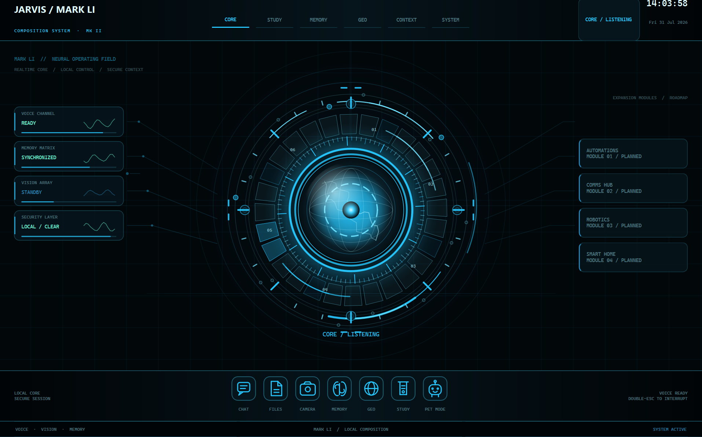

# JARVIS — Mark LI v2.0.0

Windows desktop AI assistant prototype with real-time voice, local wake-word
activation, persistent memory, permission-controlled tools, computer
automation, and third-party integrations.

[](https://github.com/alejogaisser/J.A.R.V.I.S.-Prototype/actions/workflows/quality.yml)
[](#requirements)
[](#requirements)
[](LICENSE.md)

> **Prototype status:** JARVIS can control applications, files, and connected
> services. Keep confirmations enabled and review every sensitive action before
> authorizing it. Never publish keys, OAuth credentials, memory, or private
> configuration.



## Core capabilities

- Real-time Gemini Live voice conversations with local “Hey Jarvis” activation
  through OpenWakeWord and a configurable Vosk fallback.
- Mark LI desktop interface with Core, Pet Mode, vision, and specialized Study
  and GEO workspaces.
- Permission-controlled automation for applications, windows, input devices,
  files, web tasks, and reminders.
- User-controlled persistent memory and a graph built from stored memories.
- Optional Obsidian, Google Workspace, and Microsoft Outlook integrations.
- Local dashboard for phone access, commands, audio, and file transfer.

[Installation](#installation) · [Documentation](docs/README.md) ·
[Architecture](ARCHITECTURE.md) · [Security](SECURITY.md) · [Roadmap](ROADMAP.md) ·
[Contributing](CONTRIBUTING.md)

Mark LI is a substantial evolution of the earlier project. It reorganizes the
interface, audio lifecycle, memory, permissions, and tool registry while
preserving attribution to **Mark XLVIII** by
[FatihMakes](https://github.com/FatihMakes/Mark-XLVIII).

The previous published version is preserved under the
[`v1.5-legacy`](https://github.com/alejogaisser/J.A.R.V.I.S.-Prototype/tree/v1.5-legacy)
tag. See [CHANGELOG.md](CHANGELOG.md) for the major changes in each release.

## Current status

JARVIS Mark LI is a prototype, not a production-ready assistant. These labels
describe the current repository scope rather than a reliability guarantee.

| Classification | Scope |
| --- | --- |
| Stable / available within the prototype | Windows launcher, voice and wake-word flow, central permission path, local configuration, and persistent memory |
| Experimental | Camera and screen vision, visual automation, Study and GEO workspaces, and optional service integrations |
| Limited | macOS and Linux behavior, inherited effect verification, and optional or legacy dependency coverage |
| Not supported | Unattended sensitive automation, production or safety-critical deployment, and commercial use |

## Known limitations

- Windows is the only platform exercised by CI. Support on macOS and Linux is
  partial and is not claimed as verified compatibility.
- The primary assistant requires Gemini and network access. Optional connectors
  also depend on third-party accounts, APIs, and service availability.
- Gemini and enabled integrations send the data required for each request to
  their external providers. Local memory does not make cloud-backed operations
  fully local or private; review provider terms and avoid sensitive content.
- Automated tests isolate microphones, cameras, desktop automation, accounts,
  and other external effects; passing tests is not hardware validation.
- Visual automation depends on the active desktop, window state, display
  scaling, and recognition quality. It requires user supervision and may target
  the wrong visible control.
- Some optional or legacy paths require packages that are not yet separated
  into reproducible extras. The documented installation covers the validated
  baseline, not every inherited capability.
- Permission prompts reduce risk but do not make unattended automation safe.
  Review previews and confirmations before allowing sensitive actions.

## Requirements

| Component | Requirement |
| --- | --- |
| Operating system | Windows 10/11 recommended; some features also support macOS and Linux |
| Python | 3.12 to 3.14, 64-bit |
| Hardware | Microphone; optional camera |
| AI service | Gemini API key |
| Wake word | Bundled OpenWakeWord models; configurable Vosk fallback |

## Installation

For a complete Windows walkthrough in Spanish, including first-run checks and
troubleshooting, see [TUTORIAL.md](TUTORIAL.md).

Clone the repository and enter its directory:

```powershell
git clone https://github.com/alejogaisser/J.A.R.V.I.S.-Prototype.git
cd J.A.R.V.I.S.-Prototype
```

Create a virtual environment and install the dependencies:

```powershell
py -3.12 -m venv .venv
.\.venv\Scripts\Activate.ps1
python -m pip install --upgrade pip
python -m pip install -r requirements.txt
python -m playwright install chromium
```

You may also run the bundled installer:

```powershell
python setup.py
```

## Initial configuration

Copy the example file and add your Gemini key:

```powershell
Copy-Item config\api_keys.example.json config\api_keys.json
```

Minimal example:

```json
{
  "vision_model": "gemini-3.5-flash",
  "vision_fallback_model": "gemini-3.1-flash-lite",
  "gemini_api_key": "YOUR_KEY",
  "os_system": "windows",
  "camera_index": 0
}
```

`config/api_keys.json` is ignored by Git. Never add it to the repository.

## Running JARVIS

### Direct startup

```powershell
python jarvis_launcher.py --mode direct
```

### Voice activation

The three ONNX models required for “Hey Jarvis” are bundled in
`models/openwakeword/`. Run:

```powershell
python jarvis_launcher.py --mode wake
```

OpenWakeWord starts listening as soon as its dedicated detector is ready. Vosk
loads in the background and is attached later as a fallback. When the phrase
is detected, JARVIS restores and opens the base application in full-screen
mode. The UI renders its first frame before loading the Gemini SDK, and the
initial greeting is retried if the first session is interrupted. Pet Mode is
enabled only from the interface or through an explicit command during a
session.

To temporarily run the detector with visible diagnostics:

```powershell
python jarvis_launcher.py --mode wake --console
```

Custom phrases use Vosk as a fallback. Download a compatible model into
`models/` and configure its path:

```powershell
python jarvis_launcher.py --configure --phrases "hey jarvis" --model "models/vosk-model-small-en-us-0.15" --sensitivity 180
```

The generated configuration is stored in `config/wake_word.json` and is not
committed to Git.

## Optional integrations

### Obsidian

Copy the example and configure your vault path:

```powershell
Copy-Item config\obsidian.example.json config\obsidian.json
```

Writes and modifications require confirmation for safety.

### Google Workspace

For Gmail, Google Calendar, Google Drive, Google Docs, Google Sheets, and
Google Slides, create desktop OAuth credentials and save them using the
structure shown in:

```text
config/google_oauth_client.example.json
```

The real file must be named `config/google_oauth_client.json`.

Enable the **Gmail API**, **Google Calendar API**, **Google Drive API**,
**Google Docs API**, **Google Sheets API**, and **Google Slides API** in the same Google Cloud project. JARVIS reuses the Drive
connector's OAuth owner and protected token instead of opening a parallel
visual-automation path. Searches, reads, and exports are direct after account
authorization. Creating Google files is direct and every create/edit reports
typed API verification. Edits and Calendar writes accept explicit approval in
the original request; deletion, disconnection, clearing, and forgetting always
require a fresh confirmation.

### Microsoft Outlook

Register an application in Microsoft Entra and create:

```text
config/microsoft_oauth_client.json
```

Use `config/microsoft_oauth_client.example.json` as a reference. OAuth tokens
are stored in the operating system credential manager through `keyring`, not
in the repository.

## Permissions and security

Tools are classified by risk. Destructive or sensitive actions—such as
deleting or moving files, sending messages, modifying Obsidian, or running
development tasks—require confirmation.

Customize the local policy from:

```powershell
Copy-Item config\permissions.example.json config\permissions.json
```

Do not disable confirmations for sensitive tools without reviewing their full
scope.

## Private files and backups

The `.gitignore` excludes, among other items:

- API keys and `.env` files;
- OAuth clients and local certificates;
- personal configuration and connector audit data;
- JARVIS personal memory;
- Vosk models;
- virtual environments, caches, and logs.

These files **are not restored when you clone the repository**. Keep an
encrypted private backup before reinstalling your system. Never publish them
to GitHub, even in a private repository.

## Testing

Install the development dependencies, which include the runtime and pytest:

```powershell
python -m pip install -r requirements-dev.txt
```

```powershell
python -m pytest
```

Run the complete reproducible baseline—dependencies, launcher, imports, tool
inventory, syntax, tests, and diff—with:

```powershell
powershell -ExecutionPolicy Bypass -File scripts\validate_baseline.ps1 `
  -Python .\.venv\Scripts\python.exe
```

See the [documentation index](docs/README.md) for the complete technical
documentation, [docs/baseline.md](docs/baseline.md) for scope, limitations, and
the clean installation procedure, and
[docs/tool_migration_matrix.md](docs/tool_migration_matrix.md) for the
contractual inventory of the 37 tools.

To check project syntax only:

```powershell
python -m compileall -q .
```

## Project structure

```text
.
├── main.py                    # Primary session, audio, and tool dispatch
├── jarvis_launcher.py         # Direct or wake-word startup
├── wake_word.py               # OpenWakeWord, Vosk fallback, and audio diagnostics
├── ui.py                      # PyQt6 graphical interface
├── ui_mk2/                    # Mark LI Core, Pet Mode, and visual workspaces
├── actions/                   # Actions available to JARVIS
├── connectors/                # Gmail, Calendar, Drive, and Outlook
├── core/
│   ├── permissions/           # Policy, risk levels, and confirmations
│   ├── tools/                 # Central tool registry and execution
│   ├── installer.py           # Optional component installation
│   ├── security.py            # Additional security rules
│   └── prompt.txt             # Assistant personality and instructions
├── dashboard/                 # Local web panel and phone connection
├── memory/                    # Persistent-memory managers and scripts
├── models/openwakeword/       # Minimal ONNX models for “Hey Jarvis”
├── config/                    # Examples and ignored local configuration
├── tests/                     # Automated tests
└── utils/                     # Paths and temporary files
```

## Contributing

Contributions should be proposed from a fork through a focused pull request.
Follow [CONTRIBUTING.md](CONTRIBUTING.md), review
[SECURITY.md](SECURITY.md), run the relevant tests, and confirm that the change
contains no secrets, personal configuration, memory data, or private logs.

## Credits and license

JARVIS Mark LI derives from **Mark XLVIII**, created by
[FatihMakes](https://github.com/FatihMakes). The reference version is
[commit `d178f6b`](https://github.com/FatihMakes/Mark-L/commit/d178f6b).
This adaptation preserves the original author's personal, non-commercial use
terms and identifies its modifications in [NOTICE.md](NOTICE.md).

The Mark LI contributions and modifications are by
[Alejo Gaisser (`@alejogaisser`)](https://github.com/alejogaisser), formerly
`@AlejoGaisser07`. This identifies responsibility for the Mark LI adaptation;
it does not claim authorship of the original Mark XLVIII code or third-party
components.

To the extent that the maintainer owns the relevant rights, the original Mark
LI modifications are published under
[Creative Commons BY-NC 4.0](LICENSE.md). This is publicly available source
code for personal, non-commercial use; it is not represented as open-source
software under the OSI definition.

Wake-word models and other external components remain subject to their own
licenses. Review [THIRD_PARTY_NOTICES.md](THIRD_PARTY_NOTICES.md) and
[SECURITY.md](SECURITY.md) before publishing a fork.

This independent project is not affiliated with, sponsored by, or endorsed by
Marvel Entertainment, Marvel Studios, The Walt Disney Company, or any owner
of trademarks associated with JARVIS or Iron Man.
